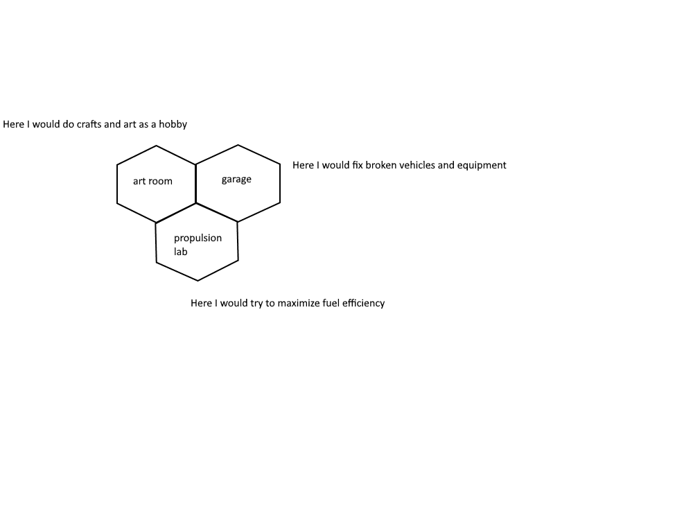

# XENON
- Xenon is the main fuel in an ion engine
- Xenon is a chemical element with the symbol Xe and atomic number 54
- Colorless noble gas that doesn't smell like anything
- Its found in small amounts in the earth's atmosphere 
- It is made in nuclear fission and is the most significant neutron absorber in nuclear reactors   
- Electricity arcs through xenon more easily than air and produces an effect like in the picture  
 

# ION THRUSTER
- An ion thruster works by taking electrons out of atoms
- Ion thrusters use the coulomb force to accelerate the ions while aiming them in the right direction
- The coulomb force is the attraction between positively and negatively charged particles (similar to the poles on a magnet)
- The gas needs to be neutral for the thruster to work
- They use xenon because it is more dense than other neutral gases
- Even though this seems like science fiction the first concepts and tests were carried out in the early 19 hundreds 

# HYDRAZINE
- Hydrazine is an inorganic compound  
- Its chemical formula is N2H4 and is colorless flammable and smells like ammonia
- The maximum safe exposure limit for vapors in the air is 0.013 mg per m^3 for a maximum of 8 hours
- It has an explosive limit of 1.8–99.99% compared to gasoline which has an explosive limit of 1.4–7.6% 
- They use it as a fuel because it can ignite with only 0.01% oxygen so they don't need to send as much oxidizer up to space
- Exposure causes seizures, coma, and multiple other adverse effects

# ROCKET ENGINE
- It uses a stream of high speed gas to propel the ship
- Most rocket engines use the combustion of reactive chemicals like hydrazine
- There are also engines that are non combustion engines like cold gas thrusters and nuclear thermal rockets
- Rocket engines need to carry their own oxidizer so they can be used in space
- When compared to other jet engines rocket engines are the lightest with the highest thrust but are the least fuel efficient 
- They use boosters to help with atmosphere escape
- The boosters use solid fuel because they don't have to carry their own oxidizer

# HYDROXYLAMMONIUM NITRATE   
## hy-drox-y-lam-mo-nium ni-trate
- It is an inorganic compound with the chemical formula NH3 OHNO3
- It is easier to store because in its pure form it is a solid which doesn’t kick of as many fumes
- It is preferable to hydrazine because it’s not as toxic and it has 50% higher performance per m^3 which allows for the spaceship to go farther with the same tank size
- Nasa is currently developing engines that use this fuel 
- This fuel was originally developed by the military

# OTHER POINTS
- Mars is moving 86871 kmh so you can't go straight there or you would crash into it
- The trip to mars took 253 days for the curiosity lander 
- The calculations are very complicated and one error can cost the whole project. An example of this is in 1999 for a mars orbiter they didn't convert from pounds to newtons and was placed in the atmosphere and destroyed by the atmospheric friction.  

<a href = "https://lgrunewa7301.github.io/" target = "self">
 Back to main page
</a>
