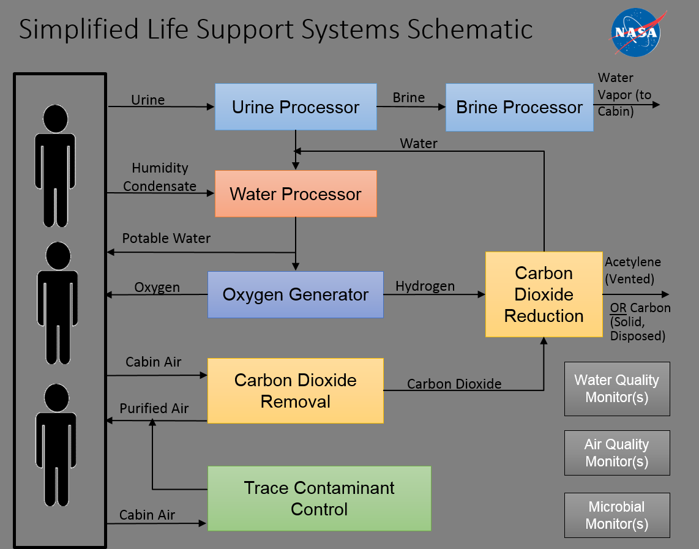

# Life Support
My wing is where we keep essential life support. There's an air pressurizer in every wing and in the main area, and all of them will need to be fixed, along with broken air locks.
A schematic of how the overall life support should work:

## Air Pressure
For every room in the base we'll need to have air pressure similar to Earth's and a good air flow. This allows the air to have oxygen and other gases mixed into it and for people to breathe. We'll also need air locks everywhere - between base and outside, between wings and the central hub, even for medical wings and for lab rooms. This allows for the base to have more efficient air conditioning, and if a wing fails and starts letting in Martian air the whole base won't depressurize.

## Space Toilets
Mars doesn't have enough gravity to allow for normal toilets. On the ISS, toilets work with air suction and waste is exposed to the vacum of space in order to prevent it from spreading disease and smell. For a Mars base, we might want the suction part, but what we do with it after will change. Once we collect everything, we can seperate it into two categories:
- Liquid waste we can process back into drinking water. We do this on the ISS already.
- Solid waste we use to fertilize our farms.

# Food

## What's a good food source to farm?
Food processing is great, but what are we going to be preparing? Our food supply has to fufill these criteria in order to be viable on Mars.
- Fast turnover of crop
- Able to rebound from crop failure
- Infrequent crop failure
- Easy and efficient to feed
- Shouldn’t require special or heavy equipment
- Able to provide all the nutrients humans need to live

This excludes many kinds of food we have on Earth. Most plants need dirt to live, which is in short supply on other planets. Livestock require a lot of space, food, and time to be worth raising, and long term the investment isn't worth making. There's nothing to forage on Mars either.

## Entomoculture

One of our first food sources will be insects. The black soldier fly has a fat, oily grub and tame, silent adults with no sting. We already do a little bit of soldier fly farming on Earth, and we know how to raise and eat them. The grubs taste like nuts - after all, they have a lot of oil to grow into an adult bug, kind of like how a nut has a lot of oil to grow into an adult tree.
Soldier flies live in plastic bins or vats, and eat sewage. We can save our sewage to feed to the farm! We won't get sick from eating them because of how different flies are to humans. They digest everything dangerous to us, and we get to harvest some of the grubs. which have good balances of vitamin B, fat, iron, calcium, and amino acids.

## Algae Bay & Hydroponics

Algae is full of potassium, iron, magnesium, many B complex vitamins, and vitamin C. It grows in vats perfectly well and it helps to make gelatin. Once we get on our feet on Mars, we could send in an algae and hydroponics bay.

Hydroponics has come a long way and can help bring variety to the Martian diet by allowing us to grow Earth vegtables and herbs, along with cotton to help replace clothing and sheets. In the hydroponic water we can raise fish, because the fish help plants to grow and the plants help the fish to grow.

## Food Processing

How will we cook this food, though? We can seperate grubs into oil and flour, which allows us to make all sorts of things. We can also send in spices as light cargo with other shipments. Baking food is going to be a main way of cooking, because low gravity means no frying or boiling due to safety issues. When we bake we'll be using high-altitude versions of recipies, as the air pressure is probably going to be lower than on Earth.

[Under Construction link to "Bubble Houses"]() | [Under Construction link to "Farming"]()
