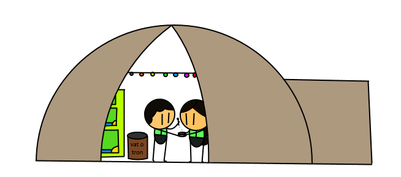

# Life Support
My wing is where we keep spare life support. There's an air pressurizer in every wing - our base will end up quite big - but when they need repairing I'm the person who helps fix them.

# Farming / Cafeteria

Our food supply has to fufill these criteria in order to be viable on Mars.
- Fast turnover of crop
- Able to rebound from crop failure
- Preferably very hard to have failure at all
- Easy to care for, easy to feed
- Shouldn’t require extra special or super heavy equipment
- Able to provide all the nutrients humans need to live

This excludes many kinds of food we have on Earth. Most plants need dirt to live, which is in short supply on Mars. 

Stuff to copy/paste
```Insects 
have good balances of vitamin B, fat, iron, calcium, and amino acids. 
They live in plastic bins or vats. Depending on the insect, turnover for crops is ridiculously fast. Three days for flies, one to two months for crickets. They also eat poop, which is the easiest thing ever to procure. This means that if there’s a catastrophic insect failure, you just need to go without for a week, which is much better than starving to death.

> We don't and won't eat insects or their grubs in their raw form. We crush them up into insect flour and oil, or use them as feed for other animals.
Insects make lots of insect oil to fry things in, and taste like nuts in baking :P
```


# Dormitories
The dormitories form the upper floor of my wing. They're next to each other, with all the rooms being hexagons,





[Under Construction link to "Bubble Houses"]() | [Under Construction link to "Dormitories"]() | [Under Construction link to "Farming"]()
